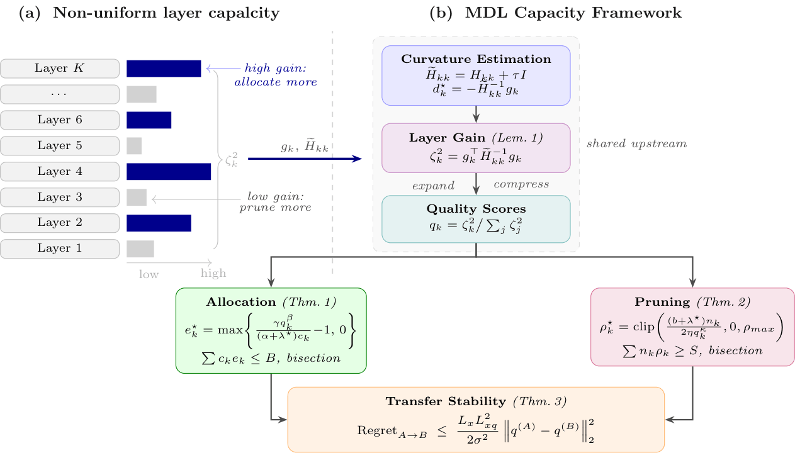

# Curvature-Weighted Capacity Allocation

**A Minimum Description Length inspired framework for capacity allocation in a Mixture-Of-Experts Large Language Model**

> UAI 2026 · [OpenReview](https://openreview.net/forum?id=K3RH5EuzD8) </br>
> Arxiv · [link](https://arxiv.org/abs/2603.00910)

This repository contains the code for two complementary experiments from the paper:

1. **Expert Allocation** — uses MDL to assign a non-uniform number of experts per layer for Mixture-of-LoRA (MoLA) fine-tuning.
2. **Layer-wise Pruning** — uses MDL to derive per-layer sparsity ratios for unstructured pruning of large language models.

Both experiments share a common MDL core (`mdl/`) that computes curvature-weighted layer importance scores, which are then consumed by the respective downstream pipelines.

## Workflow



---

## Repository structure

```
mdl-layerIF/
├── mdl/                            # MDL core: importance scoring, expert allocation, pruning ratios
│   ├── logUtility.py               # MDL → per-layer expert counts (expert allocation)
│   ├── pruning.py                  # MDL → per-layer sparsity ratios (pruning)
│   ├── my_layer_influence.py       # Layer Influence Function computation (kronfluence)
│   ├── util.py / util_mali.py      # Shared MDL utilities
│   ├── get_B.py                    # Curvature (Fisher/Hessian) estimation helpers
│   ├── model_profiling.py          # Model parameter counting utilities
│   ├── data/                       # Pre-computed MDL pruning ratio JSONs (paper results)
│   └── data_dp/                    # Depth-prior variant pruning ratio JSONs
│
├── Expert_Allocation/              # MoLA fine-tuning pipeline
│   ├── LayerIF_Computation/        # Layer Influence Function computation for expert allocation
│   │   ├── compute_IF.py           # Computes per-layer IF values using kronfluence
│   │   ├── lora_model_alpha.py     # LoRA α estimation helper
│   │   └── expert_allocator.ipynb  # Notebook: IF values → expert count assignments
│   ├── src/                        # MoLA model/trainer (adapted from HF Transformers + PEFT)
│   ├── utils/                      # prompter.py (alpaca), callbacks.py (streaming, AGPL-3.0)
│   ├── templates/                  # Alpaca prompt templates
│   ├── configs/                    # Dataset/expert configuration JSONs
│   ├── run_all.sh                  # Train on all six datasets
│   ├── eval_all.sh                 # Evaluate on all six datasets
│   └── expert_number.py            # AlphaLora baseline expert allocation
│
├── LayerIF_Pruning_New/            # Layer-IF pruning pipeline
│   ├── main.py                     # Entry point: prune + evaluate an LLM
│   ├── run_mistral_mdl.sh          # Run MDL-ratio pruning on Mistral-7B
│   ├── run_mistral_mdl_depth_prior.sh  # Depth-prior variant
│   ├── wait_then_run_mistral.sh    # Sequential job launcher
│   ├── data/                       # Pre-computed LayerIF/alpha/OWL metric caches (Mistral, Gemma)
│   └── full-environment.yml        # Conda environment for pruning experiments
│
├── pyproject.toml                  # uv environment for MDL core scripts
├── requirements.txt                # Full pipeline dependencies (pinned lm-eval, kronfluence, …)
├── LICENSE                         # MIT (see NOTICE for third-party licenses)
└── NOTICE                          # Third-party attributions
```

---

## Setup

There are three environments depending on which part of the pipeline you are running.

### MDL core (`mdl/`) — uv

The MDL scoring scripts (`logUtility.py`, `pruning.py`, `my_layer_influence.py`, etc.) use a lightweight environment managed with [uv](https://docs.astral.sh/uv/).

```bash
# Install uv if you don't have it
curl -LsSf https://astral.sh/uv/install.sh | sh

# Create the environment and install all dependencies (reads pyproject.toml + uv.lock)
uv venv --python 3.10
uv sync
```

To activate:
```bash
source .venv/bin/activate   # Linux/macOS
```

Dependencies are declared in [pyproject.toml](pyproject.toml): numpy, scipy, matplotlib, pandas, scikit-learn, weightwatcher, safetensors, powerlaw, tqdm.

<!-- ### Expert Allocation environment — conda

```bash
conda env create -f Expert_Allocation/alphalora-train.yml   # training
conda env create -f Expert_Allocation/alphalora-eval.yml    # evaluation
```

### Pruning environment — conda + pip

```bash
conda env create -f LayerIF_Pruning_New/full-environment.yml
pip install -r requirements.txt          # lm-eval (pinned), kronfluence, …
pip install torch==1.10.1+cu113          # Mistral
# or for Gemma:
# pip install torch==1.12.1 torchvision==0.13.1 torchaudio==0.12.1 \
#   --extra-index-url https://download.pytorch.org/whl/cu113
``` -->

---

## Quickstart

### Expert Allocation

The pipeline runs in four stages:

**1. Compute Layer Influence (IF) values**

```bash
cd Expert_Allocation/LayerIF_Computation
python compute_IF.py
```

Outputs per-layer IF scores to `outputs/layerIF_values/<model>/`.

**2. Derive per-layer expert counts from MDL**

```bash
python mdl/logUtility.py
```

Reads IF scores and applies MDL budget allocation. Adjust the `rho` scaling factor (line 188) to target a total expert count (default 160, matching the MoLA convention).

**3. Train MoLA on six datasets**

Edit `Expert_Allocation/run_all.sh` to set `base_model`, `number_experts`, and `top_k`, then:

```bash
bash Expert_Allocation/run_all.sh
```

**4. Evaluate**

```bash
bash Expert_Allocation/eval_all.sh
```

---

### Layer-wise Pruning

Pre-computed MDL pruning ratios are already in `mdl/data/`. To run pruning directly:

```bash
bash LayerIF_Pruning_New/run_mistral_mdl.sh
```

To re-derive pruning ratios from scratch:

```bash
python mdl/pruning.py
```

Outputs per-layer ratio JSONs consumed by `LayerIF_Pruning_New/main.py`.

Example pruning command (Mistral-7B-v0.1, magnitude + MDL ratios, 50% sparsity):

```bash
CUDA_VISIBLE_DEVICES=0,1,2,3 python LayerIF_Pruning_New/main.py \
    --model mistralai/Mistral-7B-v0.1 \
    --prune_method magnitude_ww \
    --sparsity_ratio 0.5 \
    --ww_metric IF-300-96-smoothed \
    --ww_metric_cache LayerIF_Pruning_New/data/mistral-7b/ \
    --epsilon 0.3 \
    --eval_zero_shot
```

---

## Citation

```bibtex
@inproceedings{
uai2026CurvatureWeightedCapacityAllocation,
title={Curvature-Weighted Capacity Allocation: A Minimum Description Length Framework for Layer-Adaptive Large Language Model Optimization},
author={Theophilus Amaefuna, Hitesh Vaidya, Anshuman Chhabra, Ankur Mali},
booktitle={Forty-Second Annual Conference on Uncertainty in Artificial Intelligence},
year={2026},
url={https://openreview.net/forum?id=K3RH5EuzD8}
}
```

---

## License

This repository is released under the MIT License. See [LICENSE](LICENSE) and [NOTICE](NOTICE) for details, including third-party attributions. `Expert_Allocation/utils/callbacks.py` is licensed separately under AGPL-3.0-only (see its header).
